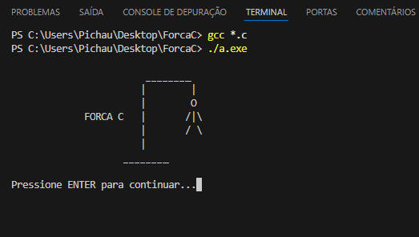
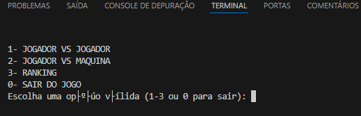
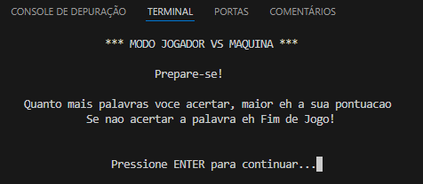
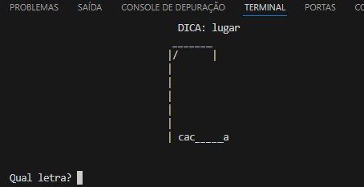

# Jogo da Forca

## Descrição

O **Forca C** é um projeto desenvolvido em linguagem C como parte de um trabalho acadêmico para a disciplina Estrutura de Dados do curso de TSI (Tecnologias em Sistemas para a Internet), do IFSP-Araraquara. O projeto implementa o popular jogo da Forca. Trata-se de um jogo simples de adivinhação de palavras. No caso, uma pessoa define uma palavra qualquer que deve ser secreta e desenha traços representando cada letra dela. Então, os jogadores tentam adivinhar as letras uma por uma. A implementação possui duas modalidades: **Jogador vs Jogador** e **Jogador vs Máquina**. 

## Regras implementadas

De modo geral, as regras do jogo serão as seguintes:  

- **Dica**: A cada rodada, uma dica sobre a categoria da palavra é fornecida (por exemplo, "fruta", "objeto", etc.). 

- **Tentativas de letras**: Os jogadores tentam adivinhar uma letra por vez. Se a letra estiver na palavra, ela é revelada; se não estiver, uma parte da figura da forca é desenhada.

- **Rodadas**: O jogador ganha se descobrir a palavra dentro do limite de erros permitidos. O jogador perde a rodada caso a figura da forca for completada (cabeça, tronco, braços e pernas), o que acontece quando o jogador erra seis vezes. 

## Estratégias
  O jogo foi implementado utilizando três TADs (Tipo Abstrato de Dados):
  1. TAD Jogo da Forca: Definido em forca.h e implementado em impl_forca.c, encapsula os dados e as operações do jogo da forca, implantando a lógica base do jogo.
  2. TAD Pilha: Definido em T_stack.h e implementado em T_stack_impl.c, encapsula os dados e as operações de uma pilha. A função da pilha no jogo é armazenar as palavras e as dicas para as rodadas da modalidade jogador vs máquina.
  3. TAD Lista Simplesmente Encadeada: Definido em LinkdList.h e implementado em LinkdListImpl.c, encapsula os dados e as operações de uma lista simplesmente encadeada. A função da lista é o de armazenar e exebir o raking. 
  
## Recursos
- Duas modalidades de jogo: **Jogador vs Jogador** e **Jogador vs Máquina**.
- Banco de palavras armazenado em um arquivo TXT.
- Pilha para empilhar/armazenar as palavras oriundas do banco de palavras e controlar o fluxo das rodadas da modalidade jogador vs máquina.
- Sistema de pontuação baseado em acertos e erros.
- Ranking para registro da pontuação dos jogadores.
- Lista Simplesmente Encadeada para armazenar os elementos do ranking.  

## Requisitos

Para compilar e executar o jogo, é necessário ter:

- **Compilador GCC** instalado.
- Sistema operacional compatível com C (Linux, Windows ou macOS).
  OBS: O código foi desenvolvido para rodar tanto no Windows como no Lixux, porém utilizamos a biblioteca canio.h para melhorar a interação com o jogo. Trata-se de uma biblioteca específica para o Windows não compatível de forma direta com o Lixus. Recomendamos utilizar o Windows para rodar o jogo. 

## Instalação

1. Clone este repositório:

   ```bash
   git clone https://github.com/lucasparila/ForcaC.git
   
2. Acesse o diretório do jogo:
   
   ```bash
   cd ForcaC

3. Compile o código:

   ```bash
   gcc -o forca main_forca.c impl_forca.c -Wall

4. Execute o jogo:

   ```bash
   ./forca

## Como Jogar

- **Modo Jogador vs Jogador**: Um jogador define a palavra secreta e a dica, enquanto o outro tenta adivinhar. Essa modalidade é livre para os jogadores definirem a dinâmica das rodadas e também os critérios para definir um ganhador.
- **Modo Jogador vs Máquina**: O jogo sorteia palavras de uma pilha estruturada com palavras de diferentes níveis de dificuldade. A cada palavra descoberta o jogador soma 1 ponto. Caso o jogador seja enforcado, o jogo termina. A soma total dos pontos no jogo define a sua posição no ranking. Se o jogador começar outro jogo, a pontuação inicia do zero. 
- Nas duas modalidades, o jogador tem um número limitado de tentativas para adivinhar a palavra antes de perder. Cada erro adiciona uma parte do corpo do enforcado. O jogador perde quando o corpo do enforcado está completo, que acontece quando se atinge seis tentativas erradas.
- 
## Telas do jogo

O jogo é apresentado via terminal de forma simples. A seguir apresentamos algumas telas do jogo:

### 1. Tela de Abertura


Apresenta o nome do jogo e o desenho de uma forca completa feita totalmente com caracteres.

### 2. Menu


Menu simples apresentando todas as opções dentro do jogo.

### 3. Abertura Jogador vs Máquina


### 4. Tela Principal para o Jogo


Tela que apresenta a forca e o fluxo de adivinhação. Essa é a tela principal do jogo, para as duas modalidades.

Por fim, em um primeiro momento, o jogo está desenvolvido para rodar com os recursos do terminal apenas, por isso tem uma apresentação simples e intuitiva.


## Desenvolvimento do Projeto

O projeto foi desenvolvido em um período de 5 semanas, com cada semana focada em uma parte específica do desenvolvimento. Abaixo está o resumo das atividades semanais e das estratégias adotadas:

### Semana 1 e 2: Lógica Base do Jogo (TAD Jogo da Forca)
- **Objetivo**: Definir e implementar a lógica base do jogo da forca.
- **Atividades**: Discussão e definição das funções para manipular os dados do jogo (palavras e dicas), de acordo com as regras.
- **Resultados**: Implementação das funções para criar, destruir e manipular o jogo da forca, encapsuladas em um Tipo Abstrato de Dados (TAD).

### Semana 3 e 4: Banco de Dados e Pilha de Palavras
- **Objetivo**: Criar um banco de dados em formato TXT contendo palavras e dicas, e implementar uma pilha para gerenciar essas palavras no jogo.
- **Atividades**: Implementação das funções para carregar as palavras do banco de dados e empilhá-las em uma estrutura de pilha.
- **Resultados**: A pilha foi utilizada para, no fluxo do jogo, desempilhar a palavra e a dica de cada rodada.

### Semana 5: Ranking e Fluidez da Interface
- **Objetivo**: Desenvolver o sistema de ranking e melhorar a fluidez da interface do jogo.
- **Atividades**: Implementação das funções para gerenciar o ranking usando uma Lista Simplesmente Encadeada e adição de funções para melhorar a fluidez da interface.
- **Resultados**: A estrutura de dados Lista Simplesmente Encadeada foi utilizada para armazenar os elementos do ranking. Funções adicionais foram implementadas para limpar a tela e manter as informações mais importantes visíveis durante as rodadas.

### Colaboração
- **Metodologia**: O desenvolvimento foi realizado de forma colaborativa, com ambos os desenvolvedores trabalhando juntos em todas as partes do projeto. Em vez de dividir o trabalho, preferimos sempre trabalhar juntos na mesma tarefa, garantindo uma sinergia e troca de ideias constantes.
- **Benefícios**: Essa abordagem colaborativa permitiu a identificação rápida de problemas, brainstorming conjunto e um desenvolvimento mais coeso e integrado.


## 👨‍💻 Feito Por

<p>
    
    <p>Lucas Eduardo Parila<br>
    <a href="https://github.com/lucasparila">GitHub</a> &nbsp;|&nbsp; 
    <a href="https://www.linkedin.com/in/lucas-eduardo-parila-18638b252/​">LinkedIn</a>
</p>
<p>
    
    <p>
    Matheus Correa<br>
    <a href="https://github.com/lucasparila">GitHub</a> &nbsp;|&nbsp; 
    <a href="https://www.linkedin.com/in/lucas-eduardo-parila-18638b252/">LinkedIn</a>
</p>
<br/><br/>

---
